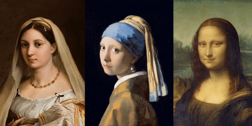
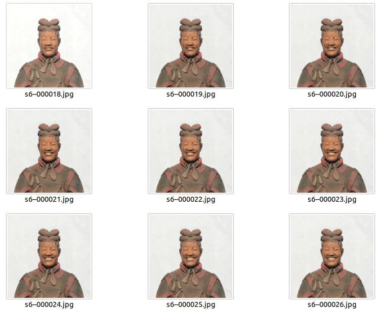

<h1 align="center">LivePortrait: Efficient Portrait Animation with Stitching and Retargeting Control</h1>


<p align="center">
  
  <br>
  🔥 For more results, visit our <a href="https://liveportrait.github.io/"><strong>homepage</strong></a> 🔥
</p>


## 1.Introduction
This repo, modified by [LivePortrait: Efficient Portrait Animation with Stitching and Retargeting Control](https://arxiv.org/pdf/2407.03168).


## 2.Getting Started
### 1. Clone the code and prepare the environment
```bash
git clone https://github.com/Xiangyu33/AnimateFace
cd AnimateFace

# create env using conda
conda create -n AnimateFace python==3.9.18
conda activate AnimateFace
# install dependencies with pip
pip install -r requirements.txt
```

### 2. Download pretrained weights
Download our pretrained LivePortrait weights and face detection models of InsightFace from [Google Drive](https://drive.google.com/drive/folders/1UtKgzKjFAOmZkhNK-OYT0caJ_w2XAnib) or [Baidu Yun](https://pan.baidu.com/s/1MGctWmNla_vZxDbEp2Dtzw?pwd=z5cn). We have packed all weights in one directory 😊. Unzip and place them in `./pretrained_weights` ensuring the directory structure is as follows:
```text
pretrained_weights
├── insightface
│   └── models
│       └── buffalo_l
│           ├── 2d106det.onnx
│           └── det_10g.onnx
└── liveportrait
    ├── base_models
    │   ├── appearance_feature_extractor.pth
    │   ├── motion_extractor.pth
    │   ├── spade_generator.pth
    │   └── warping_module.pth
    ├── landmark.onnx
    └── retargeting_models
        └── stitching_retargeting_module.pth
```

### 3. Inference 🚀

```bash
python demo.py -output_concate_video
```

If the script runs successfully, you will get `output/s6--d0_concat.mp4`. This video left to right is: driving video, input image, and generated result.
<p align="center">
  
</p>

2. `output/s6--d0.mp4`.This is generated video.
3. `output/s6--frameid.jpg`.This is generated frames.
<p align="center">
  
</p>

Or, you can change the input by specifying the `-s` and `-d` and arguments:

```bash
# driven data from video 
python demo.py -s assets/examples/source/s9.jpg -d assets/examples/driving/d0.mp4 -output_concate_video

# driven data from frames
python demo.py -s assets/examples/source/s9.jpg -d assets/examples/driving/d4 -output_image

# only output generate video
python demo.py -output_video

# only output frames
python demo.py -output_image

# only output concate_video
python demo.py -output_concate_video

# or disable pasting back
python demo.py -s assets/examples/source/s9.jpg -d assets/examples/driving/d4 -output_concate_video --no_flag_pasteback

# more options to see
python demo.py -h
```


## Acknowledgements
Thank the amazing job of [LivePortrait](https://github.com/KwaiVGI/LivePortrait),rthis epo is mainly refer to LivePortrait.
